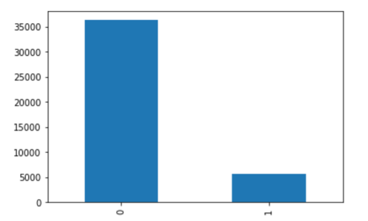

Defaulting Loans Predictions Final Report

Banks loan money to people for a variety of needs whether for new business ideas, home investment or personal endeavors. Sometimes this symbiotic relationship between the bank and an individual turns one sided if the individual can’t repay the borrowed money. In an attempt to profile or predict a collection of circumstances that predict when a borrower will default on his/her loan, measurable data has been collected to then perform training and testing to predict loan defaults before any money changes hands.

The best way to predict such a complex decision is through machine learning. Machine learning models, however, can only account for tangible features that are definable and readily available. So, trying to create a model that accounts for the human element with all its uncertainties is no small feat. 

Some models to try for this scenario include classification models such as Linear SVM, Logistic Regression, AdaBoost, Random Forests and a few more. The simpler the better because understanding how the model does its predicting is important to knowing where to change the bank’s lending rules. 

In this case, the data includes features hard facts about the loan, such as duration, interest rate and so on as well as more subjective features such as a description of the purpose of the loan, which is supplied by the borrower. 

Jumping into the data: 
					Default (1) vs. Non-Default (0)

		

Note: 87% of the data classify as non-defaulting (0), which is very unbalanced. 
The Data:
The dataset used to train these classification models came from https://data.world/jaypeedevlin/lending-club-loan-data-2007-11. The shape of the data is 115 features by 42538 rows of data all in one csv file (42.3 MB). The first go round, no extra feature engineering was done other than to convert the loan_status column into meaningful default values of 0 or 1 (our dependent variable). 

Future Additions:
A future enhancement to this project would be to use NLP to quantify the information from the description column. 

Metrics:
To determine if a model is effective or not requires a method of testing. So, in this project, a test dataset of 30% of the total collected data will be used to define how effective are the results. In this case, because the data is heavily weighted on the non-defaulting individuals with nearly 87% non-defaulting, Accuracy would be a misleading metric. This is because the probability of predicting a non-defaulting individual would be 87% without even using a model. So, the F1-score is a better choice for measuring the model’s effectiveness with precision and recall both having some input on the matter. 

How to use the information derived from this project?
Take the model with its 98.7% reliability score and filter through loan applications.
Build upon the model with more data (try to balance out the data).
Sell the model to other banks or use it as a service. 

